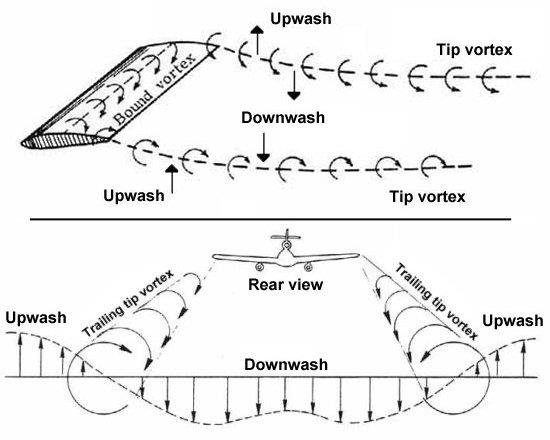
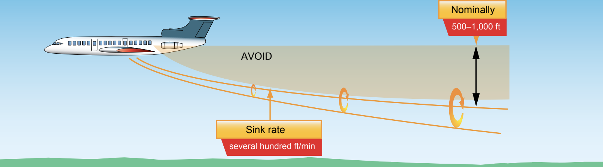
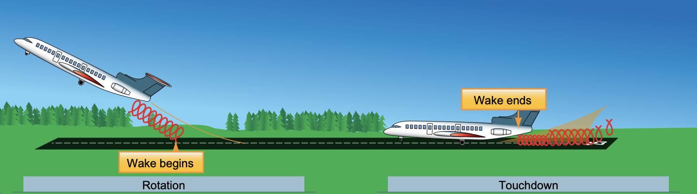
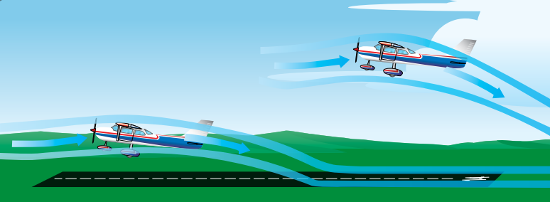

# Vortices & Wake Turbulence

### Why do wingtip vortices occur?

At any time the aircraft is flying, there's higher pressure underneath the wing and lower pressure ontop of the wing. The air tries to go from high pressure to low pressure around the wingtip circulating outwards to cause vortices.

**Vortex Circulation** Wingtip vortices are worst at:

1. Developing lift
2. High angles of attack

**Greatest vortex strength**:

1. Heavy
2. Cleans
3. Slow airspeed

**Wingtip vortices**: Sink behind an aircraft.

- To avoid them, fly above altitude of the aircraft generatin wingtip vortices.

On the ground these vortices spread apart from each other.

**Maximum Caution (wingtip vortices)**: In light quartering tail wind.

**Landing behind large aircraft**: Fly above landing aircraft flightpath.

- Land beyond the point of where the nose wheel of the large aircraft touched the ground because of lift yielded vortices before.

**Take off behind large aircraft**: Fly above and upwind.

- As soon as the larger aircraft's nose wheel leaves the ground, lift begins and so do vortices.

# Ground Effect

An aircraft flies within a wingspan of itself to the ground.

Pressure differential usually destroys lift ontop of the aircraft's wings as air moves high pressure to low pressure.

When the ground appears it interferes with the air flowing to the top. All of the lift ontop of the wing isn't destroyed.

**Ground effect** is caused by interference of Earth's surface with airflow patterns

### Problems with Ground Effect

1. Take off -> becoming airborne before reaching take off speed
2. Floating -> increased drag & excess speed\*

_\* occurs one wingspan from surface_
