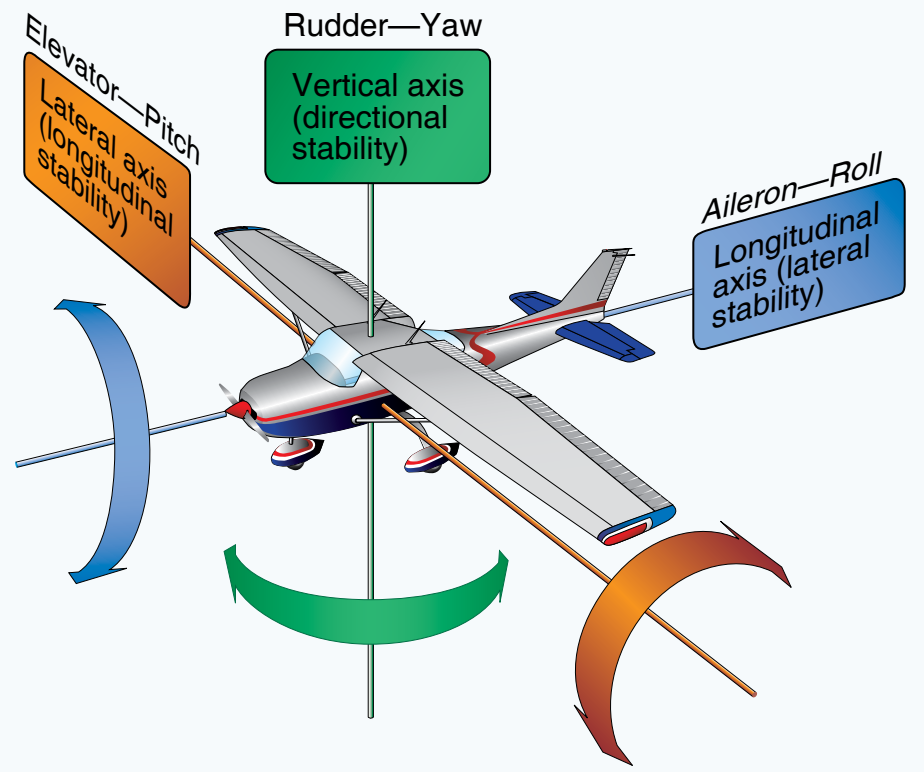
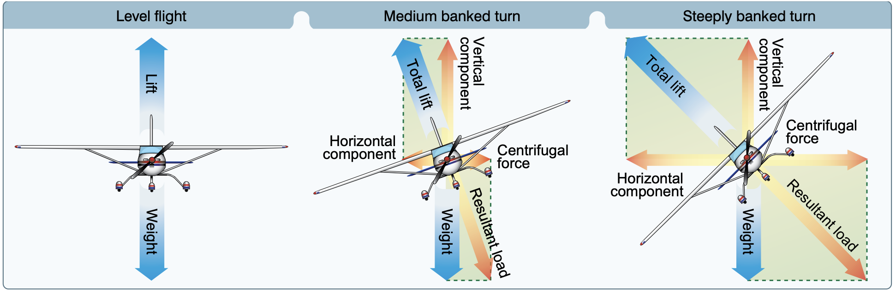
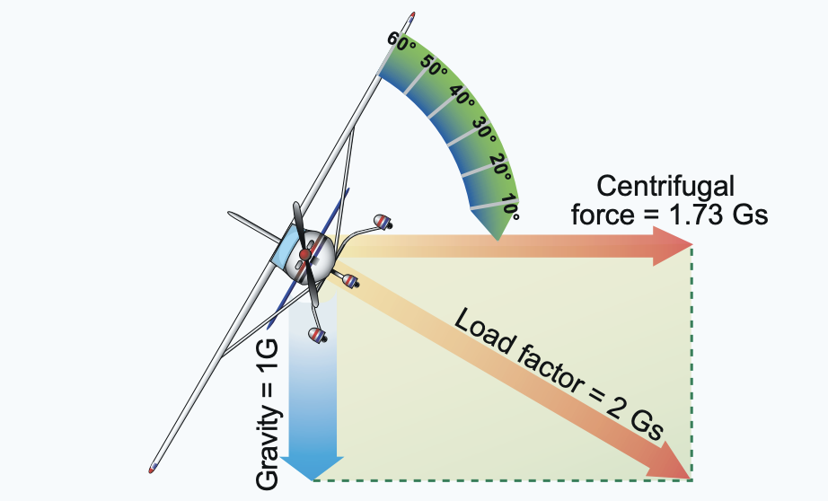
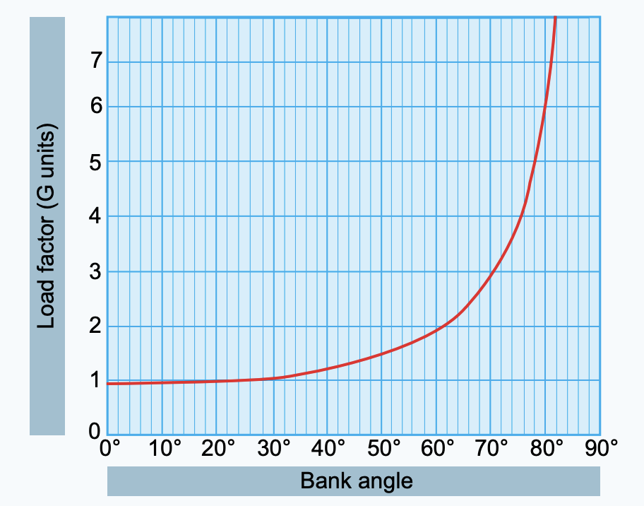

# Practical Aerodynamics

## Flaps

### Why do you put flaps down on an aircraft?

1. Increase the drag
2. Also increase lift

> Flaps are used to increase the descent angle without lowering airspeed.

## Stability

### What is aircraft stability?

An aircraft's stability can measured by the three axes it can rotate over.

### Aircraft axes



| **Axes of Rotation** | **Airplane Movement** | **Primary Control Surface** | **Type of Stability** |
| -------------------- | --------------------- | --------------------------- | --------------------- |
| Longitudinal         | Roll                  | Aileron                     | Lateral               |
| Lateral              | Pitch                 | Elevator/Stabilator         | Longitudinal          |
| Vertical             | Yaw                   | Rudder                      | Directional           |

### Longitudinal Stability

Recall that the nose is pitching over the lateral axist but moving longitudinally.

Most planes are built so that if you pull the nose up and let go it goes back to equilibrium as it oscillates.

**Longitudinal Stability**: Refers to the aircraft's stability in its plane of symmetry about the lateral axis.

#### What determines Longitudinal Stability?

Location of Centre of Gavity (CG) to Center of Lift determines the longitudinal stability of the aircraft.

Note that CG is usually infront of the center of lift and the tail exerts a downward force.

**Inherently Stable**: The aircraft requires less effort to control.


> Landing to the most aft CG limit is less stable for all speeds.

## Controllability

Controllability is impacted by:

1. Location of CG
2. Power changes
3. Change in AoA (α)

> CG that is aft of limits makes it difficult to recover from stalled conditions.

Reducing power with no control adjustments yields less air from propeller slipstream. The nose will pitch up.

Elevator effectiveness is reduced when:

1. Power is reduced
2. Downwash from propeller slipstream is reduced

> Flying faster and at a lower angle of attack (α) causes Center of Pressure (CP) to move aft yielding more tail down force.

- High speeds and low AoA
- Considered more stable

> Flying slower and change in AoA (α) causes Center of Pressure (CP) to move fore causing the nose to pitch up from less tail down force.

- Considered less stable

**Banking**: A manuever to change aircraft heading.

> **Ailerons** are used to bank an aircraft; to cause one wing tip to move up and the other wing tip to move down.



### What happens in no rudder use when banking?

The aircraft will roll and yaw in the opposite direction. This is dubbed adverse yaw.

**Adverse Yaw**: The tendenacy of an aircraft to yaw in the opposite direction during a turn while rolling.

#### Why does this happen?

This is example it's a right turn (bank).

| Aileron Position | Angle of Attack | Lift      | Drag      | Explanation                        |
| ---------------- | --------------- | --------- | --------- | ---------------------------------- |
| Left down        | increases       | increases | increases | Direction of the wind moves back   |
| Right up         |                 | decreases | decreases | Direction of the wind goes forward |

> Apply rudder to correct for adverse yaw.​⬤

## Load Factor

Performing turns/banks increases the load factor.

During a turn, increase the angle of attack to prevent the aircraft from descending.

**Load Factor**: The ratio of the lift of an aircraft to its weight. Measured in G's (acceleration of gravity).



> An increase in load factor causes stalls to occur at higher speeds.

> The speed of the aircraft determines the excess load put on the wings.

### How much load does an aircraft experience during a turn?

These can be calculated using load factor charts.



> Total Load = Weight \* Load Factor

```python
Example:
Airplane.weight = 3300 # lbs
Airplane.bank_angle = 30 # degrees

total_load = w * lf = 3300 * 1.2 = 3960 # lbs
```
