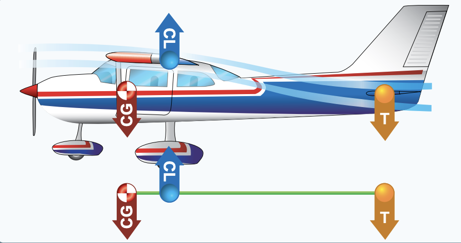
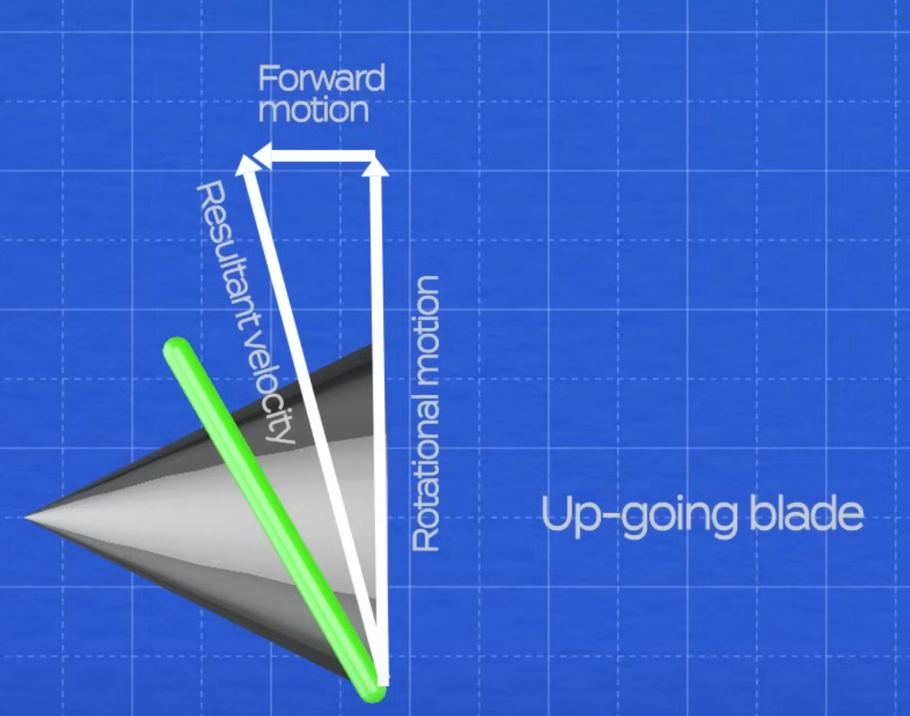

# Practical Aerodynamics

## Flaps

### Why do you put flaps down on an aircraft?

1. Increase the drag
2. Also increase lift

> Flaps are used to increase the descent angle without lowering airspeed.

## Stability

### What is aircraft stability?

An aircraft's stability can measured by the three axes it can rotate over.

### Aircraft axes


| **Axes of Rotation** | **Airplane Movement** | **Primary Control Surface** | **Type of Stability** |
| -------------------- | --------------------- | --------------------------- | --------------------- |
| Longitudinal         | Roll                  | Aileron                     | Lateral               |
| Lateral              | Pitch                 | Elevator/Stabilator         | Longitudinal          |
| Vertical             | Yaw                   | Rudder                      | Directional           |

### Longitudinal Stability

Recall that the nose is pitching over the lateral axist but moving longitudinally.

Most planes are built so that if you pull the nose up and let go it goes back to equilibrium as it oscillates.

**Longitudinal Stability**: Refers to the aircraft's stability in its plane of symmetry about the lateral axis.

#### What determines Longitudinal Stability?

Location of Centre of Gavity (CG) to Center of Lift determines the longitudinal stability of the aircraft.

Note that CG is usually infront of the center of lift and the tail exerts a downward force.

**Inherently Stable**: The aircraft requires less effort to control.



> Landing to the most aft CG limit is less stable for all speeds.

## Controllability

Controllability is impacted by:

1. Location of CG
2. Power changes
3. Change in AoA (α)

> CG that is aft of limits makes it difficult to recover from stalled conditions.

Reducing power with no control adjustments yields less air from propeller slipstream. The nose will pitch up.

Elevator effectiveness is reduced when:

1. Power is reduced
2. Downwash from propeller slipstream is reduced

> Flying faster and at a lower angle of attack (α) causes Center of Pressure (CP) to move aft yielding more tail down force.

- High speeds and low AoA
- Considered more stable

> Flying slower and change in AoA (α) causes Center of Pressure (CP) to move fore causing the nose to pitch up from less tail down force.

- Considered less stable

**Banking**: A manuever to change aircraft heading.

> **Ailerons** are used to bank an aircraft; to cause one wing tip to move up and the other wing tip to move down.


### What happens in no rudder use when banking?

The aircraft will roll and yaw in the opposite direction. This is dubbed adverse yaw.

**Adverse Yaw**: The tendenacy of an aircraft to yaw in the opposite direction during a turn while rolling.

#### Why does this happen?

This is example it's a right turn (bank).

| Aileron Position | Angle of Attack | Lift      | Drag      | Explanation                        |
| ---------------- | --------------- | --------- | --------- | ---------------------------------- |
| Left down        | increases       | increases | increases | Direction of the wind moves back   |
| Right up         |                 | decreases | decreases | Direction of the wind goes forward |

> Apply rudder to correct for adverse yaw.​⬤

## Load Factor

Performing turns/banks increases the load factor.

During a turn, increase the angle of attack to prevent the aircraft from descending.

**Load Factor**: The ratio of the lift of an aircraft to its weight. Measured in G's (acceleration of gravity).


> An increase in load factor causes stalls to occur at higher speeds.

> The speed of the aircraft determines the excess load put on the wings.

### How much load does an aircraft experience during a turn?

These can be calculated using load factor charts.


> Total Load = Weight \* Load Factor

```python
Example:
Airplane.weight = 3300 # lbs
Airplane.bank_angle = 30 # degrees

total_load = w * lf = 3300 * 1.2 = 3960 # lbs
```

## Left Turning Tendancy

_hold right rudder_

Assume we have a two bladed propeller. As an aircraft moves forward, the blades follow a cork screw path. Both blades experience forces with respect to their movement.





The diagrams depict the vectors of both the blades as they spin. Note that the relative airflow will be in the opposite direction of the resultant velocity.


At level flight and no other factors, both blades will travel the same distance travelled, angle of attacks and thrust output.

The angle between the blade and relative airflow is the blade's own angle of attack.


At lower aircraft speeds and high nose attitude, the prop shaft is inclined up. The rotational plane is no longer prependicular to the aircraft's flight path.


Drawing out the vectors, the down-going blade has a greater angle of attack than the up-going blade.


In addition, the down-going blade moves a greater distance through the air than the up-going blade.


Both effects yields the down-going blade to produce more thrust than the up-going blade. This causes the aircraft to yaw to the left.

## Torque Effect


The engine makes the propellers rotate to produce thrust. Applying Newton's 3rd law, there is a reaction that rolles the aircraft left.

**Torque Effect**: Rotate in the opposite direction of propeller rotation.

Older aircraft are designed to have more lift at cruise generated by the left wing. Weight at the wings is also used to combat low airspeed torque effect.

> Torque effect is greatest at:
>
> 1. High power settings
> 2. Low airspeed
> 3. High angle of attack

| Symbol         | Name                      | Explanation                                                                                                           |
| -------------- | ------------------------- | --------------------------------------------------------------------------------------------------------------------- |
| V<sub>LE</sub> | Landing Gear Extended     | The highest speed an aircraft can safely fly with the landing gear extended                                           |
| V<sub>X</sub>  | Best Angle of Climb       | Airspeed that allows an aircraft to gain most altitude in the shortest horiztonal distance                            |
| V<sub>Y</sub>  | Best Rate of Climb        | Airspeed that provides an aircraft the greatest altitude gain in the shortest amount of time                          |
| V<sub>A</sub>  | Maneuvering               | Maximum speed at which the aircraft is designed to maneuver; stall before structural damage (increase in load factor) |
| V<sub>S0</sub> | Stall (Landing)           | Minimum flight speed in landing configuration                                                                         |
| V<sub>S1</sub> | Stall (Flying)            | Minimum steady flight speed in a specific configuration                                                               |
| V<sub>FE</sub> | Flaps Extended Speed      | Maximum speed an aircraft can fly with flaps extended                                                                 |
| V<sub>N0</sub> | Structural Cruising Speed | Maximum speed that the aircraft can fly in the smooth air                                                             |
| V<sub>NE</sub> | Never Exceed Speed        | Maximum speed an aircraft can fly; anything more can cause structural damage                                          |

> In severe turbulence:
>
> 1. Maintain level flight
> 2. Allow minor variations in airapeed and altitude

## Reading the Airspeed Indicator


Above is an example of a basic True Airspeed Indicator (TAS Meter).


**White Arc**: Flap operating range (55 kts to 100 kts)

> V<sub>S0</sub> is the lower limit and V<sub>FE</sub>

**White Arc**: Normal operating range (55 kts to 165 kts)

> V<sub>S1</sub> is the lower limit for power-off stalling speed (flaps+landing gear retracted) and V<sub>N0 is the maximum structural cruising speed.</sub>

**Yellow Arc**: Caution Range; fly in this range only in smooth air conditions

**Red Radial Line (V<sub>NE</sub>)**: Maximum speed for aircraft in calm air.
