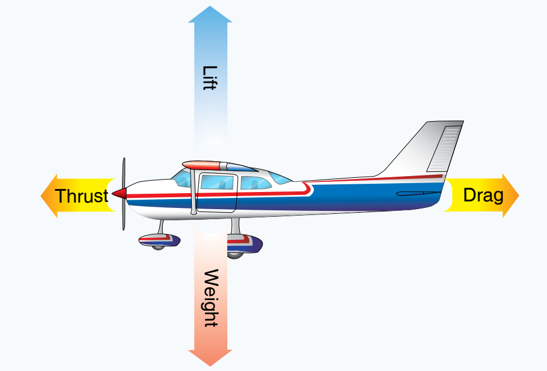

# Aedrodynamics

## Forces

There are four forces that act on an airplane:

1. Thrust (Ft)
2. Lift (Cl)
3. Drag (D)
4. Weight (W)

**Unaccelerated flight:** Not changing speed or direction.

_straight & level flight_

> Cl = W and (Ft) = D (Equilibrium)

## Lift

### Bernoulli's experiment

Forced water through a tube (Venturi) and measured pressures.

**Bernoulli's Principle:** increase in the speed of a fluid results in decrease of pressure or height above a datum.

In flight, Bernoulli's principle states that air moving over the curved upper surface of the wing will travel faster and thus produce less pressure than the slower air moving across the flatter underside of the wing.

### Wing architecture and flight

Air travelling faster over the curved upper surface of the wing causes lower pressure on the top surface.

**Angle of Attack (α)**: The accute angle at which the relative wind meets the chord line of the airfoil.

As you increase α you get more lift _**iff**_ air can conform to the surface of the wing.

**Critical Angle of Attack:** Airfoil will ALWAYS stall andyields maximum lift coefficient.

> Critical α at stall remains the same regardless of change in gross weight, airspeed or altitude.

## Spins

How do you spin an airplane?

1. The aircraft must be stalled.
2. Both wings of the aircraft must be stalled to spin in either direction.

## Frost

Disrupts the smooth airflow over a wing and decreases its lifting capacity.

_Remove frost before flight._

- Frost may prevent the aircraft from becoming airborne at normal take off speed.
