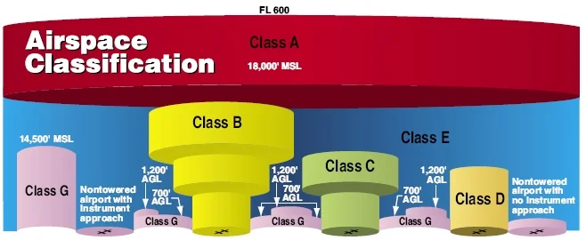

# Airspace

The portion of atmosphere above a country's territory and territorial waters divided into zones by authorities for managing air traffic, safety and military operations with international coordination by ICAO to ensure orderly flight.

## Classifications of Airspaces

### Controlled

Airspace where air traffic controllers (ATC) actively manage and provide services (i.e. separation) to aircraft.

Classes A, B, C, D and E are controlled airspaces.

### Uncontrolled

The part of airspace where ATC doesn't actively provide separation or direction to aircraft. Pilots here should rely on VFR and self-regulation such as using Common Traffic Advisory Frequencies (CTAFs).

Class G is uncontrolled airspace.

| Airspace Class | Memory Aid | Notes                                           |
| -------------- | ---------- | ----------------------------------------------- |
| A              | Altitude   | > 18,000 MSL ATC tracks                         |
| B              | Big        | big airports and aircraft                       |
| C              | Crowded    | congestion that needs radar sequencing          |
| D              | Dialogue   | Control towers begin; must talk before entering |
| E              | Elsewhere  | Airspace between airways                        |
| G              | Go for it  |                                                 |

## Using Airspaces

### Class G

Class Golf airspace isn't marked in sectionals but is identified by the absense of the other airspaces and height of overlying Class E airspace.

### Class E

Class Echo airspace is depicted on sectional chart with magenta shading (700 ft AGL floor), blue vignettes (1200 ft AGL floor), blue shaded lines (Victor Airways) and dashed magenta lines (surface floor).

Some airspaces are busy and need IFR services to the ground, so class E airspace can go to ground.

KTNT has a Class E airspace from Surface depicted by the magenta dotted line.

Within the Cato MOA/Smitty MOA, there is a section of airspace with fuzzy blue box. The fuzzy side of blue is Class E airspace with a floor of 1,200 ft AGL.

### Class D

Class Delta airspace is shown on a sectional chart as a blue dashed (segmented) line around an airport.

Delta airspaces are only operational during control tower hours.

> Tower closed: Becomes **Class E** _or_ **Class G if no official reporting weather or comms**.

It starts from surface and usually goes to 2,500 ft above the airport. A number in a dashed square will show the ceiling of the Delta airspace. The core area is 4.4 nautical miles or (5.5 statue miles). Lateral dimentions are based on instrument procedures established for the airspace.

San Luis Obispo airport has a higher ceiling for its Class D airspace at 2,700 ft MSL.

Salnias airport has a Class D airspace where its celing is not inclusive at 2,500 ft MSL as shown by the dashed square box.

#### Minimum Equipment

> A VHF transmitter and receiver (comms radio) is required for two-way communication.

Prior to flying into this airspace you must have two-way radio communication with the tower (during operation hours).

###### Can enter airspace

> _Tower: 7153 Papa, Stand By_.

You can enter the airspace as two-way communication has been established.

###### CANNOT enter airspace

> _Tower: Aircraft calling stand by_.

Your tail number must be read back by ATC for two-communication.

> _Tower: Commanche 7153 Papa, stand by and stay clear_.

#### Landings & Takeoff

A clearance is required to take off or land at a primary airport in Class D airspace.

If landing at a secondary airport in Class D you must radio the primary **before** entering. As for take off from a secondary, radio primary as soon as possible when able in air.

If ATC is too busy and other factors and there's explicit instructions, stay out of the airspace.

#### IFR Operations

Separation services from other IFR aircraft, along with sequencing, traffic advisories and safety alerts.

#### Tower Services

ATC towers provide the follow services:

1. Keeping airplanes separated on the runway
2. Facilitates safe, orderly and expeditious flow
3. Provies advirsories and separation services

### Class C

Class Charlie airspace is shown on a sectional chart as a solid magenta line around an airport.

#### Shelf dimensions

1. **Inner Circle** has a radius of 5 nautical miles
2. **Outer Circle/Shelf Area** normally has a vertical height from 1,200' to 4,000' ft
3. **Procedural Outer Area** is 10 nautical miles outside the inner circle

#### Minimum Equipment

In addition to Class D requirements, to enter Charlie airspace you need:

> Two way radio and a Mode C transponder with altitude encoding within Charlie up to 10,000' ft MSL.

4096 transponder codes are where 4 digits where each number can go from 0 to 7.

_ADS-B OUT may also be a requirement with recent FAA regulation changes_.

#### Landings & Takeoff

To enter Charlie airspace you must establish two-way communication. Two-way communication is established when the controller reads back tail number.

1. Call approach control to get radar service

To take off from a secondary airport, establish two-way communication on the ground or as soon as possible after takeoff.

#### Tower Services

1. VFR-to-VFR traffic advisories
2. Radar based separation in designated core and outer area
