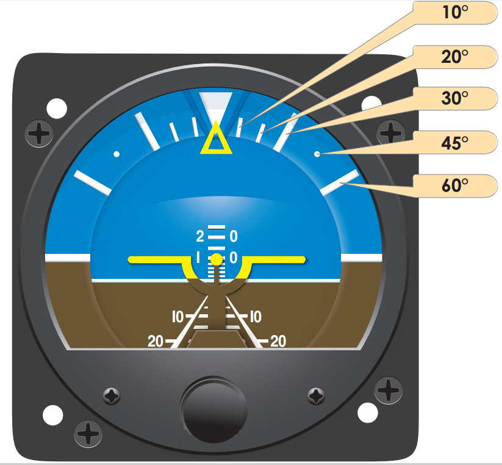
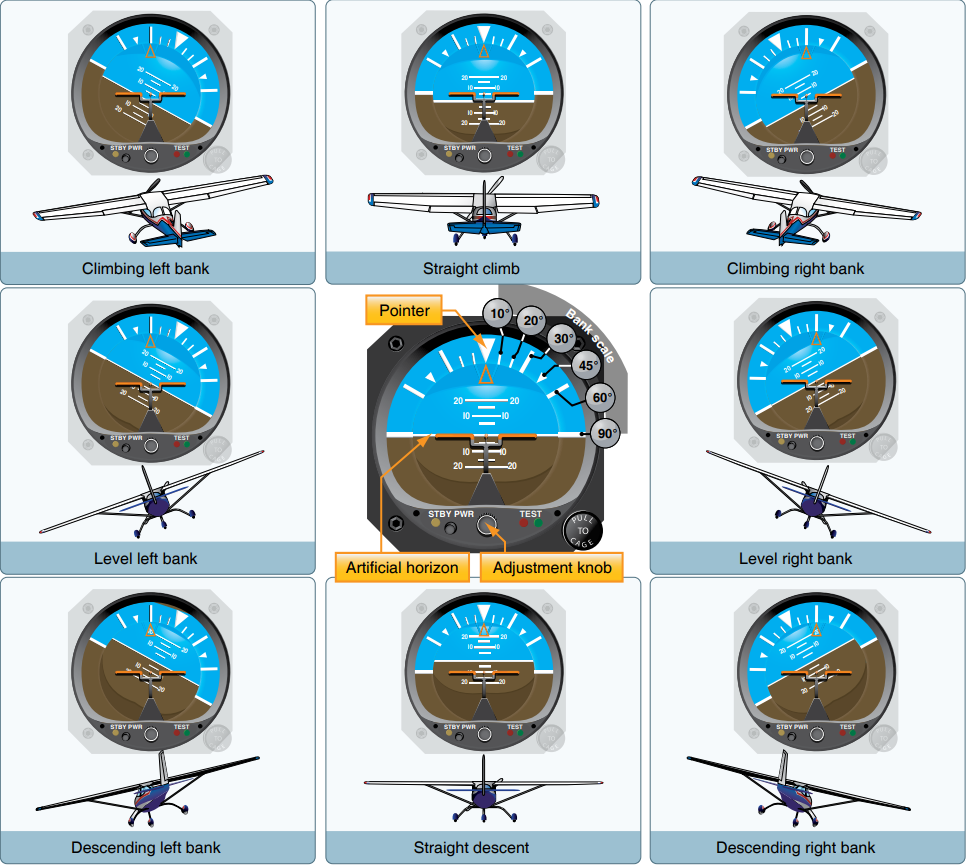
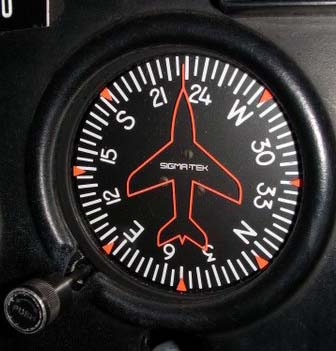
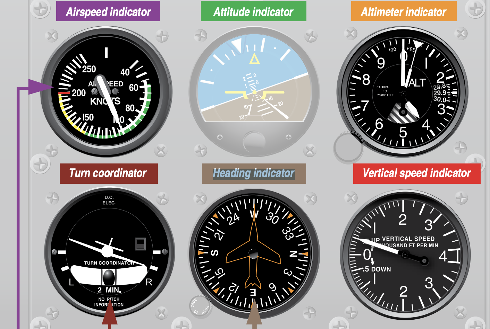
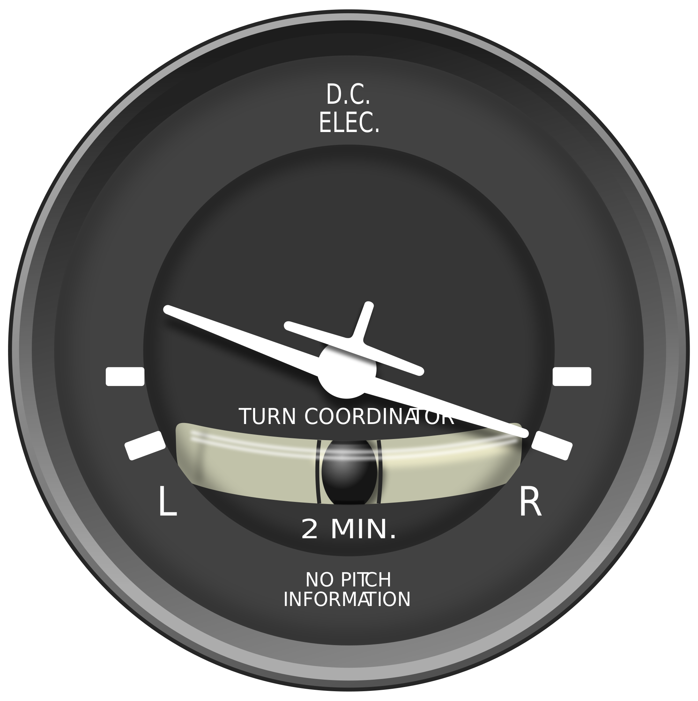
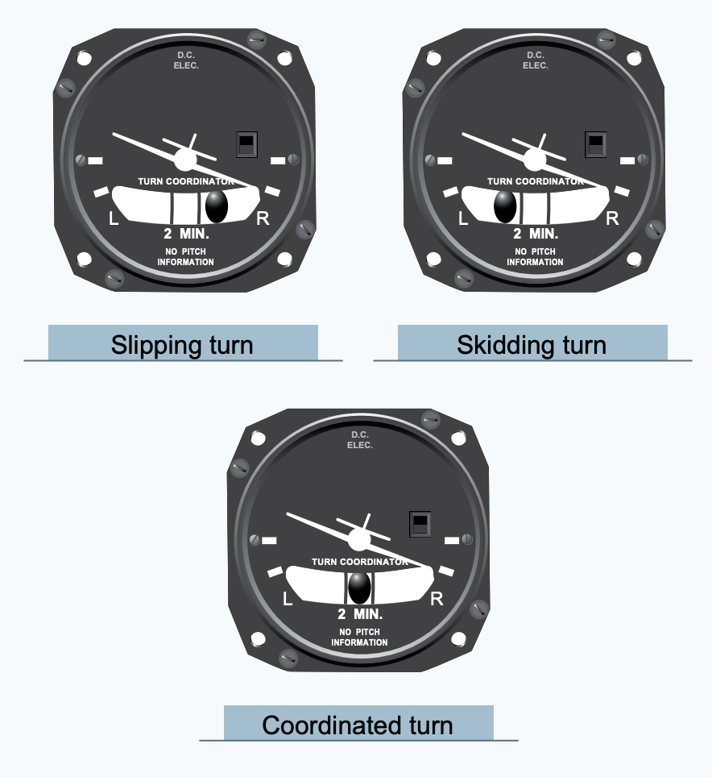

# Aircraft instruments

**Glass cockpit**: Aircraft with electronic displays and equipment.

**Analog instrument**: Mechanical devices that provide basic flight information.

- Usually aircraft have these for backup

# Attitude Instrument

Shows the attitude of the aircraft with respect to the horizon.
Often referred to as artificial horizon.

> The direction of the bank is determined by the relationship of the miniature airplane to the horizon bar
>
> - Pitch of the aircaft (nose) is shown by the dot in the horizon

The horizon moves left and right when banking and up and down when pitching.

# Heading Indicator

Shows the heading of the aircraft like a compass.

### Why is it needed?

1. Stays stable -> compass can bounce around
2. No turning errors

**Gyroscope:** Mechanical device that senses rotational motion and detect orientation to determine what direction the aircraft is facing. _(Small spinning wheel.)_

- Azis it spins around wants to stay lined up in the positoin it started ("rigidity in space")

### What do you have to do get accurate inidication from the Heading Indicator?

- Use the knob to periodically align the Heading Indicator with the compass

> Best time to do this would be in _straight and level flight_.

**Gyroscopic Precession**: Drifting from heading due to friction and Earth's rotation.

### 6 pack of flight instruments

The essential instruments for piloting any aircraft.

# Turn Coordinator

Indicates aircraft movement about roll and yaw axis.

1. Roll axis -> when the turn starts
2. Yaw axis -> as the turn progresses

This instrument displays the rate of a turn and whether the aircraft is slipping or turning during the turn.

- Gyro "resists" -> turn coordinator measures this resistance

> The more the little airplane banks, the faster your rate of turn.

**Inclinometer**: slip/skid indicator (the ball in the center of the tube).

1. Controlled Turn -> ball is in the center; nose into the wind
2. Uncontrolled Turn -> did not use rudder/aileron

> If there are side forces to the outside of the turn, it's a **skid**.
>
> - The ball moves outside of the turn

> If there are sides to the inside of the turn, it's a **slip**.
>
> - The ball moves inside of the turn

#### How to recover from a slip/skid?

Step on the rudder on the side you feel the leaning or on the side where ball is.
