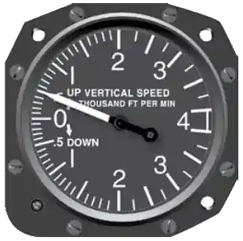

# What are the Pitot Static Instruments?

1. Airspeed Indicator
2. Vertical Speed Indicator (Rate of Climb Inidcator)
3. Altimeter

# Altimeter

An instrument that measures an aicraft's altitude or how high it is above sea level.


The hands tell you the calculated air pressure calibrated in 1000's of feet above sea level.

## Reading

There are three hands which are read individually. Add up the results to get the final reading.

1. Thin hand - 10,000's
2. Tie hand - 1,000's
3. Long hand - 100's

_Each hand indicates the percentage between the two numbers the previous hand is_

# Vertical Speed Indicator

An instrument that measures how quickly an aircraft is ascending or descending.

It measures the speed of air rushing in and out of the pitot static system.

_Other known names: Variometer, Rate of Climb Indicator, Vertical Velocity Indicator_



Reads air pressure changes at altitude. At high altitudes, air wants to rush out of the tube/hole.

**Airspeed** is calculated from the difference in rammed air and calm of the pressure air tube.

## Clogged Tubes & Vents

### Pitot Tubes

#### How can it happen?

It could be bugs, ice, mud clog from landings.

In cases of icing, turn the heat switch on from the instrument panels.

#### Which instrument is affected?

> Airspeed Indicator

### Static Port

#### Which instrument is affected?

> All instruments (altimeter, vertical speed & airspeed)

# Attitudes

**Indicated Altitude** -> what your altimeter reads

**True Altitude** -> vertical height distance above sea level

**Absolute Altitude** -> vertical distance above the surface being flown over; usually calculated

## Pressure Altitude

**A _reference altitude_ independent of local weather or pressure changes in respect to standard pressure**. This helps for altitude measurement and performance calculations.

**Standard Pressure:** 29.92 inHg (or 1013.25 hPa)

Formula:

```md
Pressure Altitude = (Standard Pressure − Current Setting) × 1,000 + Elevation
```

### High Pressure to Low Pressure (no adjustment)

Your indicated altitude will be higher than your actual altitude above sea level.

> Memory Aid: _"From high to low, look out below."_

### Low Pressure to High Pressure (no adjustment)

Your indicated altitude will be lower than your actual altitude above sea level.

> Memory Aid: _"From low to highm clear the sky."_

## Density Altitude

**It is pressure altitude corrected for nonstandard temperature**. It's the altitude the airplane _feels_ its flying.

**Standard Tempature:** 15°C (or 59°F)

Indicated altitude lower than true altitude when temperatures are warmer than standard.

--or--

Indicated altitude higher than true altitude when temperatures are below standard.
