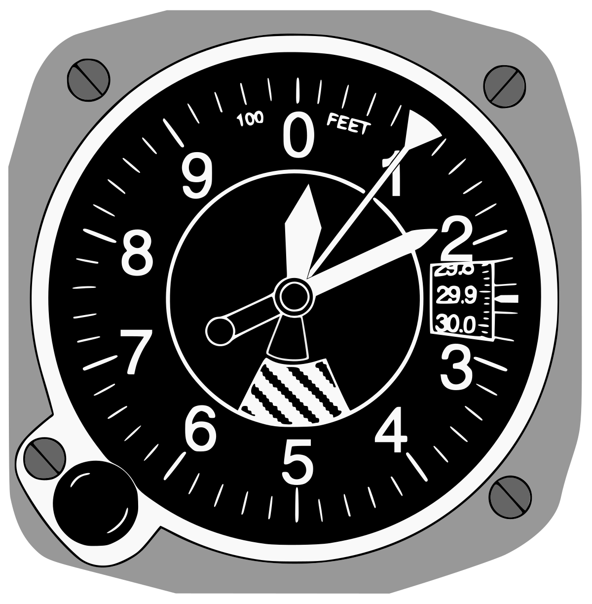

# What are the Pitot Static Instruments?

1. Airspeed Indicator
2. Vertical Speed Indicator (Rate of Climb Inidcator)
3. Altimeter

# Altimeter

A instrument that measures an aicraft's altitude or how high it is above sea level.

The hand tells you the calculated air pressure calibrated in 1000's of feet above sea level.
