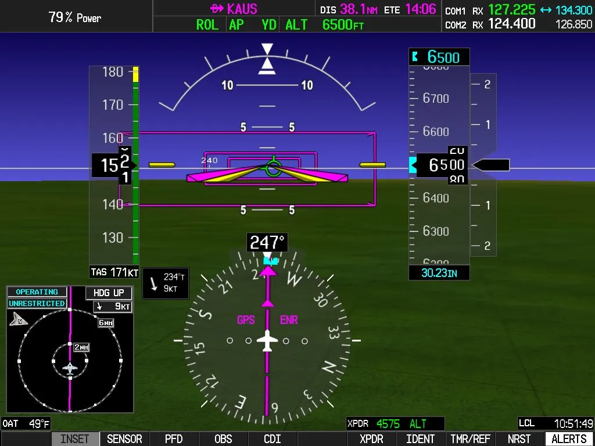
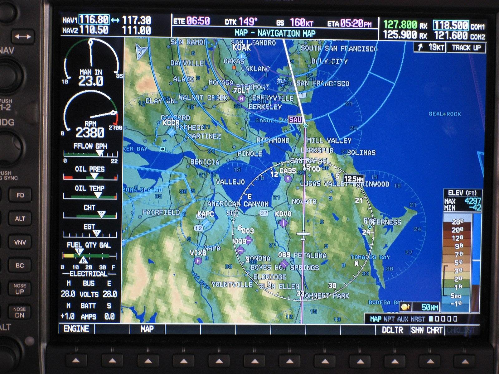

# Digital Flight Instruments

Advanced avionics that replace traditional analog _("steam")_ gauges with integrated digital screens to display crucial flight data like attitude, airpeed, altitude and heading. A flight deck that consists of all digital instruments is called a _glass cockpit_.

## Primary Flight Display (PFD)

A modern aircraft screen that consolidates essential flight information:

1. Attitude (pitch/roll)
2. Airspeed
3. Altitude
4. Heading
5. Vertical Speed
6. Turn Coordinator

## Horizontal Situation Indicator

An advanced instrument that combines magnetic heading, course guidance (VOR/ILS/GPS), and glideslope information into single, intuitive display.

## Multi-Function Display

A digital screen that consolidates various flight information like naigation, engine monitoring, weather and terrain into one view. It works with the Fight Management System (FMS) and PFD.

## Pito-Static & Gyroscopic Digital Instruments

The traditional sensors send data to be processed by the Air Data Computer (ADC) and Altitude Heading Reference System (AHRS). These systems are composed of electronic sensors like accelerometes, while heading is measured using a magnetometer.

Any large X's that show up inidicate when the ADC or AHRS are failing.

## Back up instruments

There are four that are required:

1. Airspeed Indicator
2. Attitude Indicator
3. Altimeter
4. Magnetic Compass
