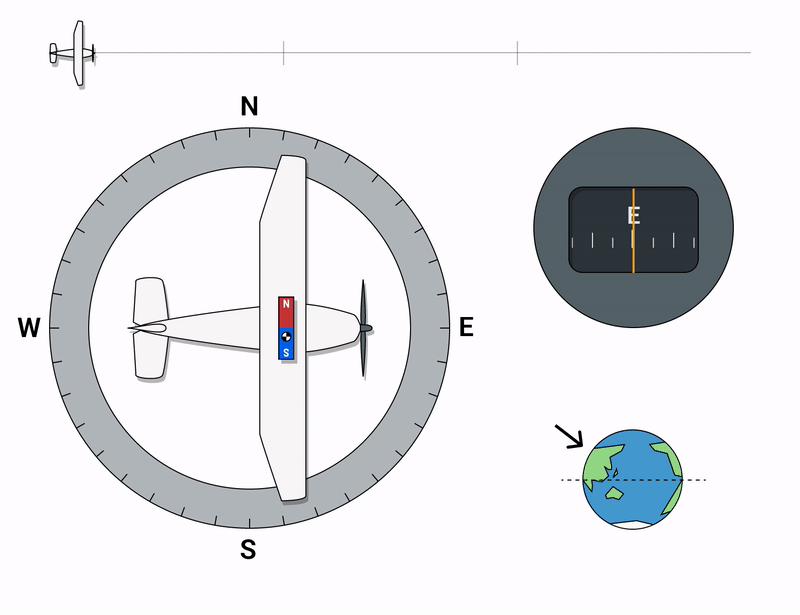

# Magnetic Compass

A vital power-free instrument that uses magnets to point to magnetic north (North Pole).
Compass errors are caused by magnetic dip.


# Magnetic Dip

> The tendency of a magnetic compass's needle to tilt vertically towards Earth's poles.

The north and south geographic poles are relative to axis rotation.


Magnetic poles refer to the convergence of magnetic force lines on Earth. Today the Magnetic Pole is just south of North Pole in Canada.

The magnetic compass will want to point down near pole/away from equator. When the aircraft is accelerating or banking the magnetic compass can tilt.

> The magnetic compass is accurate **only** in straight, level and unaccelerated flight.

### Acceleration & Deceleration Errors



As you accelerate the compass tilts.

> _Acceleration Errors_: East or West heading and accelerating shows turn to North.

> _Deceleration Errors_: East or West heading and accelerating shows turn to South.

```md
# Accelerate

# North

# Decelerate

# South
```

### Turning Errors

Another effect of magnetic dip are magnetic compass errors when doing turns from north and south headings.

> 1. Compass _lags_ when turning from a northerly heading
> 2. Compass _leads_ when turning from a southerly heading

There are no turning errors on East or West headings.

```md
# Compass

# Overshoots

# South

# Undershoots

# North
```

### Magnetic Deviation Errors

The aircraft's own magnetic fields from metal parts, electrical systems (radios, wiring, engines) distort lines magnetic force causing the magnetic compass to have error.

A pilot can correct for this by using a compass correction card.
