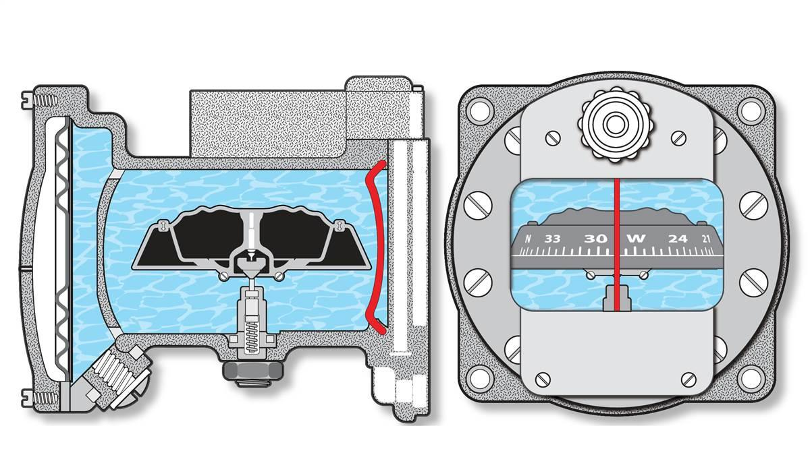
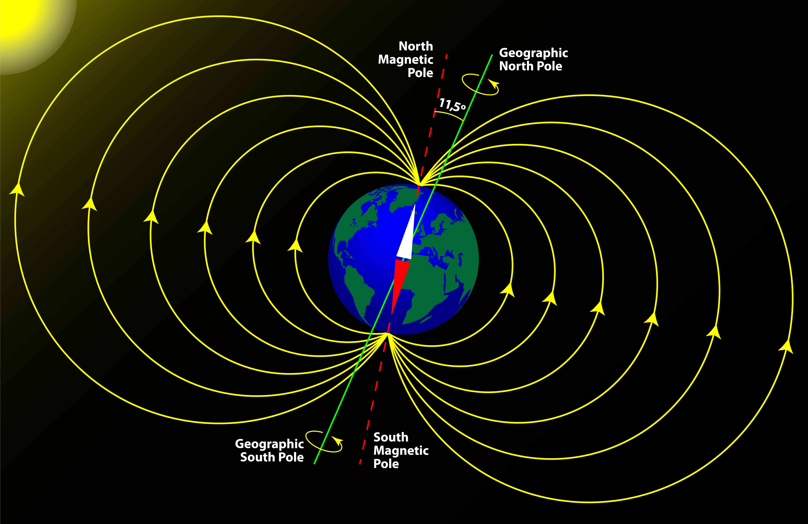

# Magnetic Compass

A vital power-free instrument that uses magnets to point to magnetic north (North Pole).
Compass errors are caused by magnetic dip.

# Magnetic Dip

> The tendency of a magnetic compass's needle to tilt vertically towards Earth's poles.

The north and south geographic poles are relative to axis rotation.

Magnetic poles refer to the convergence of magnetic force lines on Earth. Today the Magnetic Pole is just south of North Pole in Canada.

The magnetic compass will want to point down near pole/away from equator. When the aircraft is accelerating or banking the magnetic compass can tilt.
