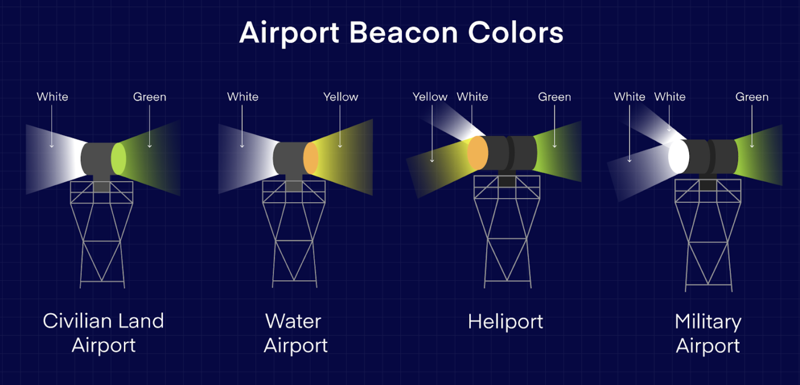

# Airports

A magenta circle is a symbol for an airport. If it's a private airport the circle will have an _R_.

A rectangle in the circle is a hard surface runway of at least 1,500 ft.

Blue circles designate controlled airports.

Tick marks around the circle are airports that have fuel services.

A star above a circle indicate an airport that has a rotating beacon.

> W G alternating is a civlian airport.

> G W W G (dual peaked white flashes) is a military airport.

> W Y G is a lighted heliport (DO NOT LAND).

> Control Tower 120.95 (South/ primary?) 133.9 (North) 128ft (elevation) MSL of airport, L lighting at airport, Automatic Terminal Information Service is on frequency channel 133.8, 129-> 12,900ft longest available runway, 122.95 UNICOM frequency
