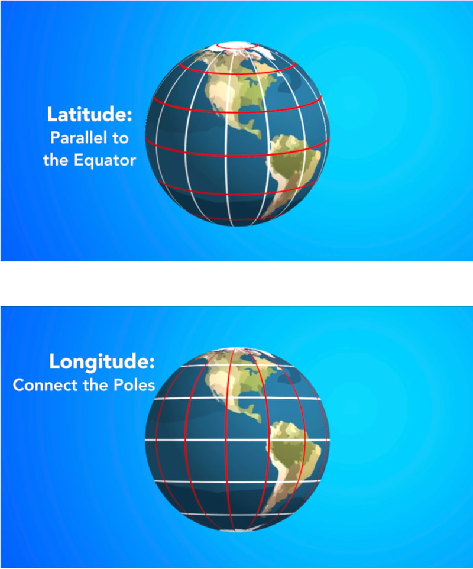
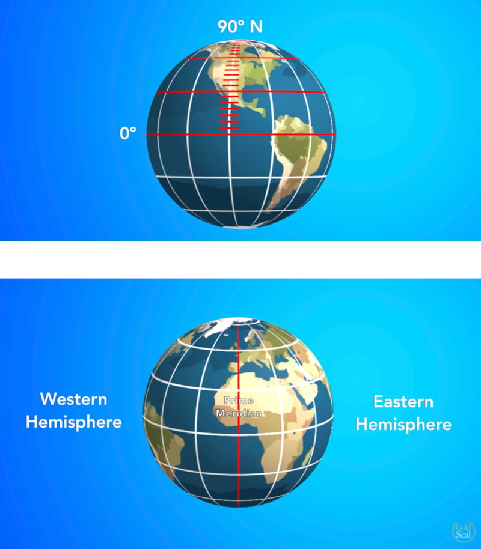
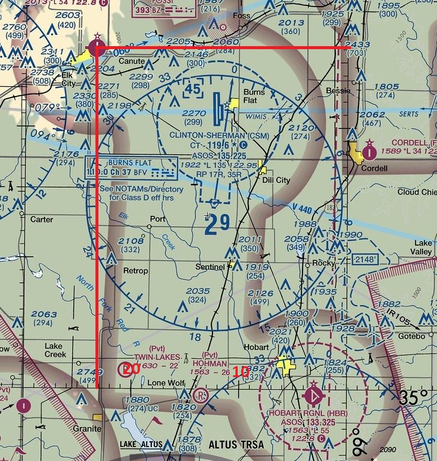

# Aviation Time

A standardized time using Coordinated Universal Time (UTC) to eliminate confusion across timezones for flight planning, air traffic control and navigation using a 24 hour format. The source being Greenich Time.


### Example 1

4 hour flight in west coast

```
  1030          PST time zone
+  800
------------
  1830

  1830
+  400          (Flight Time)
------------
  2230          Zulu arrival time
```

### Example 2

2 hour flight from west coast to mountain states.

```
  0930          CST time zone
+  600          convert
------------
  1530

  1530
+  200          Flight Time
------------
  1730          Zulu arrival time

  1730
-  700          Conversion
------------
  1030          MST arrival time
```

# Latitude & Longitude

Defines precise locations for navigation, flight planning, and waypoints using a grid system of degrees and minutes on charts like sectional charts.



> _Latitude_: Lines that are paralell to Equator (0<sup>o</sup>) measuring North and South.

> _Longitude_: Lines that East or West of the Prime Meridian (0<sup>o</sup>) and cross the equator at right angles.



Each degree of latitude/longitude is a minute.

1 minute = 1 nautical mile.

## Reading latitude & longitude on sectionals



1. Draw a horizontal line parallel to latitude
2. Draw a vertical line parallel to longtiude
3. Find the nearest latitude and longitude lines near the point of interest.
4. Read latitude off drawn longitude line found in step 3)
5. Read longtitude off drawn latitude line found in step 3)
