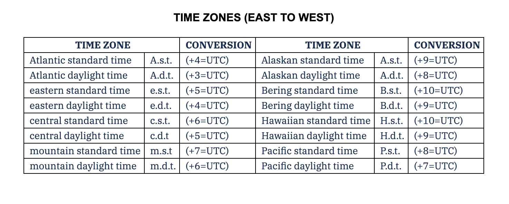

# Aviation Time

A standardized time using Coordinated Universal Time (UTC) to eliminate confusion across timezones for flight planning, air traffic control and navigation using a 24 hour format. The source being Greenich Time.



### Example 1

4 hour flight in west coast

```
  1030          PST time zone
+  800
------------
  1830

  1830
+  400          (Flight Time)
------------
  2230          Zulu arrival time
```

### Example 2

2 hour flight from west coast to mountain states.

```
  0930          CST time zone
+  600          convert
------------
  1530

  1530
+  200          Flight Time
------------
  1730          Zulu arrival time

  1730
-  700          Conversion
------------
  1030          MST arrival time
```
